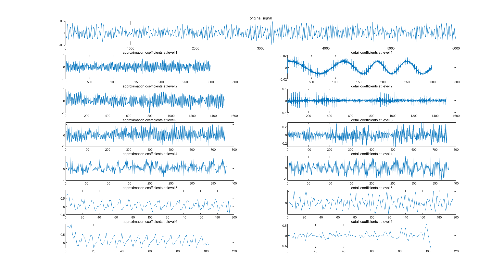

# **Homework - Topic 2:**
# **Decomposition and Reconstruction of Biosignals**

**Lai Hui Shan M5281022**

## **1. Try MATLAB sample code**
- **wavelet1hr.m**
  - **wavelet1hr.m** with **data1hr.txt**
    
    
  - **wavelet1hr.m** with **data1night.txt**
    
    

- **wavelet1min.m**
  - **wavelet1min.m** with **data1min1.dat**
    
    
  - **wavelet1min.m** with **data1min2.dat**
    
    

## **2. Find an optimal mother wavelet for signal separation**

In this homework, we will use **wavelet1hr.m** sample code and **data1hr.txt** sample data provided in **ReportKit.zip** to conduct experiments.

Since the sample code **wavelet1hr.m** is primarily based on the discrete wavelet transform (DWT), it is recommended that the following discrete wavelets be tested first:

- db4
- db6
- sym5
- coif3
- haar
- bior4.4 (Original code)
- bior3.5

In the **wavelet1hr.m**, change the value of **WAVELET_FUNC** to test different wavelets. **For example:**

```
% Test Daubechies 4 wavelets
WAVELET_FUNC = 'db4';
```

In order to compare the performance of different mother wavelet comprehensively, it is suggested to add some code to calculate the evaluation index (such as **MSE**, **SNR**, etc.) for quantitative analysis.

To test **Mean Squared Error (MSE)** and **Signal-to-Noise Ratio (SNR)**, the following code has been added below the sample code **wavelet1hr.m**:

```
% Reconstruct the full signal from coefficients c and l
reconstructed_signal = waverec(c, l, WAVELET_FUNC);

% Calculate Mean Squared Error (MSE)
mse = mean((data - reconstructed_signal).^2);

% Calculate Signal-to-Noise Ratio (SNR)
signal_power = mean(data.^2);
noise_power = mse;
snr_value = 10 * log10(signal_power / noise_power);

% End timing and calculate elapsed time
elapsed_time = toc;

% Display results
disp(['Wavelet function: ', WAVELET_FUNC]);
disp(['Mean Squared Error (MSE): ', num2str(mse)]);
disp(['Signal-to-Noise Ratio (SNR): ', num2str(snr_value), ' dB']);
disp(['Elapsed time: ', num2str(elapsed_time), ' seconds']);
```

After running the modified sample code **wavelet1hr.m**, the MATLAB command window will display. **For example:**

```
Wavelet function: db4
Mean Squared Error (MSE): 6.5645e-26
Signal-to-Noise Ratio (SNR): 229.7855 dB
Elapsed time: 5.2891 seconds
```

Here is a table summarizing all the results:

| Wavelet Function | MSE        | SNR         | Elapsed Time (seconds) |
| ---------------- | ---------- | ----------- | ---------------------- |
| db4              | 6.5645e-26 | 229.7855 dB | 5.2891                 |
| db6              | 4.3642e-26 | 231.5585 dB | 4.8790                 |
| sym5             | 1.2062e-27 | 247.1433 dB | 5.3319                 |
| coif3            | 1.2072e-26 | 237.1398 dB | 5.1025                 |
| haar             | 2.5747e-33 | 303.8503 dB | 5.0412                 |
| bior4.4          | 4.1153e-26 | 231.8136 dB | 5.6341                 |
| bior3.5          | 3.5893e-33 | 302.4074 dB | 5.3629                 |

### **Analysis of Results**

#### Mean Squared Error (MSE)

- Lower MSE indicates a smaller difference between the original and reconstructed signals, which is desirable.
- Ranking (from lowest to highest MSE):
  1. **haar:** 2.5747e-33
  2. **bior3.5:** 3.5893e-33
  3. **sym5:** 1.2062e-27
  4. **coif3:** 1.2072e-26
  5. **db6:** 4.3642e-26
  6. **bior4.4:** 4.1153e-26
  7. **db4:** 6.5645e-26
 
#### Signal-to-Noise Ratio (SNR)

- Higher SNR indicates a better quality of the reconstructed signal, with less noise.
- Ranking (from highest to lowest SNR):
  1. **haar:** 303.8503 dB
  2. **bior3.5:** 302.4074 dB
  3. **sym5:** 247.1433 dB
  4. **coif3:** 237.1398 dB
  5. **bior4.4:** 231.8136 dB
  6. **db6:** 231.5585 dB
  7. **db4:** 229.7855 dB

#### Elapsed Time

- Lower elapsed time indicates higher computational efficiency.
- Ranking (from fastest to slowest):
  1. **db6:** 4.8790 seconds
  2. **haar:** 5.0412 seconds
  3. **coif3:** 5.1025 seconds
  4. **db4:** 5.2891 seconds
  5. **sym5:** 5.3319 seconds
  6. **bior3.5:** 5.3629 seconds
  7. **bior4.4:** 5.6341 seconds

### **Determining the Best Mother Wavelet**

Based on the above analysis, we can consider the following factors:

#### Performance Metrics

- MSE and SNR are critical indicators of the reconstruction quality.
- The **Haar wavelet**(haar) has the lowest MSE and highest SNR, followed closely by the **Biorthogonal 3.5 wavelet**(bior3.5).

#### Computational Efficiency

- All wavelets have similar computational times, with differences of less than a second.
- The db6 wavelet is the fastest, but the time differences are minimal and may not significantly impact overall performance.

#### Suitability for Signal Characteristics

1. Haar Wavelet (haar):
   - Advantages:  
     - Simplest wavelet, capable of detecting sudden changes or discontinuities in the signal.
     - Excellent performance in terms of MSE and SNR in this test.
   - Disadvantages:
     - Lacks smoothness, which may not capture the signal's subtle features effectively.
     - May not be ideal for signals that require capturing smooth variations.
2. Biorthogonal Wavelet (bior3.5):
   - Advantages:
     - Provides symmetry and linear phase, which is beneficial for signal reconstruction.
     - High performance in MSE and SNR, close to that of the Haar wavelet.
   - Disadvantages:
     - Slightly slower than some other wavelets.

3. Symlets Wavelet (sym5):
   - Advantages:
     - Good balance between localization in time and frequency.
     - Better at capturing smooth features compared to Haar wavelet.
   - Performance:
     - Lower MSE and higher SNR compared to db4, db6, and coif3.
     - Slightly lower performance than Haar and Biorthogonal 3.5 in terms of MSE and SNR.

#### Practical Considerations

- Nature of the Signal:
  - If the signal contains sharp discontinuities or abrupt changes, the Haar wavelet may be appropriate.
  - If the signal is smooth or contains important frequency components that require higher-order analysis, wavelets like **sym5** or **bior3.5** may be more suitable.

- Reconstruction Quality vs. Signal Features:
  - While Haar shows the lowest MSE and highest SNR, it may oversimplify the signal due to its piecewise constant nature.
  - Biorthogonal and Symlets wavelets can capture more nuanced features of the signal, potentially providing better signal separation in practical applications.

### **Conclusion**

Based on the test results and considering both quantitative metrics and signal characteristics, the **Biorthogonal 3.5 wavelet** (bior3.5) appears to be the best mother wavelet for the signal separation.
- It offers an excellent balance between reconstruction accuracy and the ability to capture signal features:
  - Second-lowest MSE (3.5893e-33).
  - Second-highest SNR (302.4074 dB).
  - Provides symmetry and linear phase properties, which are beneficial for signal analysis and reconstruction.
- While the Haar wavelet has the lowest MSE and highest SNR, its simplicity may not capture all the essential features of the signal, especially if the signal contains smooth variations.