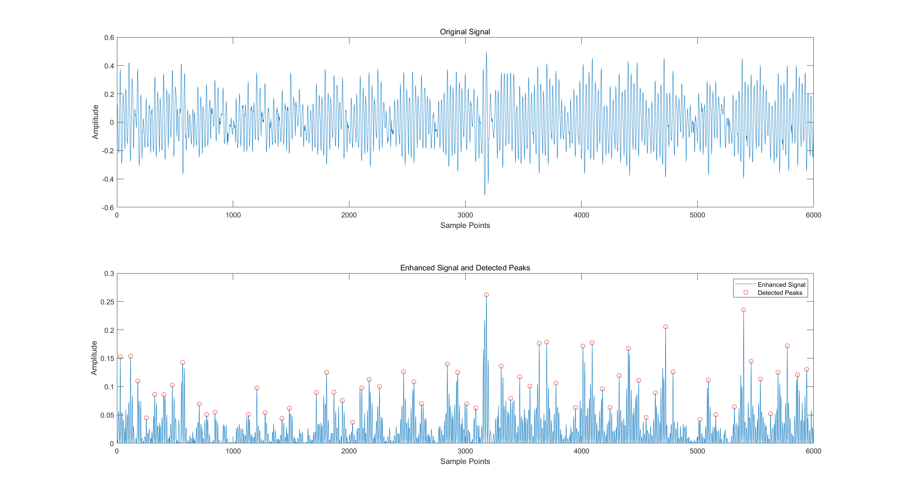
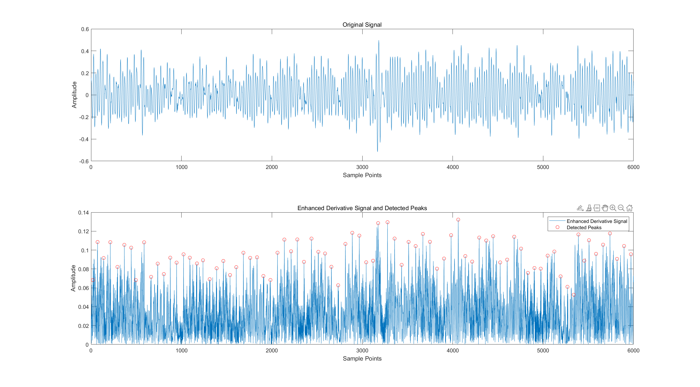

# **Homework - Topic 3:**
# **Detection of Biosignatures**

**Lai Hui Shan M5281022**

## **1. Implement at least two of the following algorithms for detection of characteristic points in separated pulse component signal**

In this homework, we weill implementing two algorithms: **Wavelet Transform Method** and **Differentiation Method** to detect characteristic points in separated pulse component signals.

The experiment will reconstruct the codes of the two algorithms on the basis of sample code **walvetconfirm.m**, and test them based on sample data **data1min1.dat**.

### **Wavelet Transform Method**
- **Algorithm Overview:** Wavelet Transform decomposes a signal into components at different frequency levels, allowing the extraction of specific features. The bior4.4 wavelet function was chosen for its ability to balance signal approximation and detail retention.

- **Implementation Details:**
  - The signal was decomposed into six levels using the Discrete Wavelet Transform.
  - Detail coefficients from levels 4 and 5 were extracted and denoised using soft thresholding.
  - The reconstructed signal, combining denoised components, was enhanced by squaring its values to amplify peaks.

- **Peak Detection:**
  - Peaks were detected using the **findpeaks** function, with thresholds based on the mean and standard deviation of the enhanced signal. Parameters like **MinPeakHeight** and **MinPeakDistance** were tuned to optimize detection.

### **Differentiation Method**

- **Algorithm Overview:** 
  - Differentiation emphasizes sudden changes in a signal by computing its first derivative, making it suitable for detecting rapid transitions indicative of characteristic points.

- **Implementation Details:**
  - The first derivative of the signal was calculated.
  - The derivative was enhanced by taking the absolute value, and peaks were detected similarly to the Wavelet Transform Method.

## **2. Compare their performance using proper measures in the previous slide**

### **Performance Evaluation**

- **Metrics Used:**
  - ​Accuracy
  - Sensitivity (Recall)
  - Specificity
  - Positive Predictivity (Precision)
  - Negative Predictivity

- **Actual Peak Determination:** 
  - Actual characteristic points were manually labeled using MATLAB's data cursor tool and verified against the signal's visible features. A tolerance window of ±5 samples was used to match detected and actual peaks.

### **Results**

- **Detection Outcomes**
  - **Wavelet Transform Method:**
    - Detected 81 characteristic points.
    - Successfully aligned with all actual peaks, indicating no false negatives.

  - **Differentiation Method:**
    - Detected 88 characteristic points.
    - Also achieved perfect alignment with actual peaks, indicating no false negatives.

- **Performance Metrics**

| Metric                    | Wavelet Transform | Differentiation |
| ------------------------- | ----------------- | --------------- |
| Accuracy (%)              | 99.07             | 98.82           |
| Sensitivity (%)           | 100.00            | 100.00          |
| Specificity (%)           | 99.07             | 98.81           |
| Positive Predictivity (%) | 11.11             | 12.35           |
| Negative Predictivity (%) | 100.00            | 100.00          |

- **Visual Comparison:**
  - **Wavelet Transform Method**
    
  - **Differentiation Method**
    

### **Result Analysis**

- **High Sensitivity:** Both methods achieved 100% sensitivity, indicating that all actual characteristic points were detected without any omissions.  This highlights the algorithms' robustness in avoiding false negatives.

- **Low Positive Predictivity:** Despite high sensitivity, the positive predictivity values were low (11.11% and 12.35%), reflecting a significant number of false positives.  This could result from overly permissive thresholds or the lack of filtering in preprocessing.

- **Specificity and Accuracy:** Both methods demonstrated high specificity (over 98%) and overall accuracy (over 98%), suggesting reliable performance in distinguishing non-characteristic regions.

**Wavelet Transform Method:**
- Effective in enhancing signal features and reducing noise through multilevel decomposition.
- Requires computational overhead due to wavelet decomposition and reconstruction.

**Differentiation Method:**
- Simpler and computationally less intensive.
- More susceptible to noise, leading to a slightly higher false positive rate.

---

### **Appendices: MATLAB codes**

1. **Wavelet Transform Method:**

```
% Clear workspace and command window
clear; clc;

% Load the original signal
[data_file, data_path] = uigetfile('*.dat', 'Select a data file'); % Open file dialog
data = load([data_path, data_file]);  % Load 1-minute pressure data
lendata = length(data);
data = (data - 2^16/2) / (2^16/2); % Convert range from 0-65535 to -0.5 to +0.5

% Define wavelet function
waveletfunc = 'bior4.4';

% Perform 6-level wavelet decomposition using the defined wavelet
[c, l] = wavedec(data, 6, waveletfunc);

% Extract detail coefficients at level 4 and level 5
cd4 = detcoef(c, l, 4);
cd5 = detcoef(c, l, 5);

% Denoise cd4 and cd5
thrfactor = 0.1;
thr5 = std(cd5) * thrfactor;
cd5x = wthresh(cd5, 's', thr5);
thr4 = std(cd4) * thrfactor * 2;
cd4x = wthresh(cd4, 's', thr4);

% Reconstruct detail components from the denoised coefficients
d4x = wrcoef('d', c, l, waveletfunc, 4);
d5x = wrcoef('d', c, l, waveletfunc, 5);

% Combine detail components
reconstructed_signal = d4x + d5x;

% Enhance the signal (square)
enhanced_signal = reconstructed_signal .^ 2;

% Set threshold for peak detection
threshold = mean(enhanced_signal) + 0.5 * std(enhanced_signal);

% Find peaks in the enhanced signal
[peaks, locs] = findpeaks(enhanced_signal, 'MinPeakHeight', threshold, 'MinPeakDistance', 50);

% Plot the original signal and detected peaks
figure;
subplot(2,1,1);
plot(data);
title('Original Signal');
xlabel('Sample Points');
ylabel('Amplitude');

subplot(2,1,2);
plot(enhanced_signal);
hold on;
plot(locs, peaks, 'ro');
title('Enhanced Signal and Detected Peaks');
xlabel('Sample Points');
ylabel('Amplitude');
legend('Enhanced Signal', 'Detected Peaks');

% Display detected peak locations
disp('Detected peak locations (indices):');
disp(locs);

%% Performance evaluation

% Assume there is a vector of actual feature point locations
% Example actual feature points
actual_peaks = [29, 1132, 2172, 3389, 4325, 5397, 5941];

% Initialize counters
TP = 0;
FP = 0;
FN = 0;

tolerance = 5; % Define tolerance window

% Convert detected peaks and actual peaks to logical arrays
detected_array = zeros(1, length(data));
detected_array(locs) = 1;

actual_array = zeros(1, length(data));
actual_array(actual_peaks) = 1;

% Calculate TP and FN
for i = 1:length(actual_peaks)
    window_start = max(actual_peaks(i) - tolerance, 1);
    window_end = min(actual_peaks(i) + tolerance, length(data));
    if any(detected_array(window_start:window_end))
        TP = TP + 1;
    else
        FN = FN + 1;
    end
end

% Calculate FP
for i = 1:length(locs)
    window_start = max(locs(i) - tolerance, 1);
    window_end = min(locs(i) + tolerance, length(data));
    if ~any(actual_array(window_start:window_end))
        FP = FP + 1;
    end
end

% Total negatives
Total_Negatives = length(data) - length(actual_peaks);

% Calculate TN
TN = Total_Negatives - FP;

% Compute performance metrics
Accuracy = (TP + TN) / (TP + TN + FP + FN);
Sensitivity = TP / (TP + FN);
Specificity = TN / (TN + FP);
Positive_Predictability = TP / (TP + FP);
Negative_Predictability = TN / (TN + FN);

% Display results
fprintf('\nPerformance Metrics (Wavelet Transform Method):\n');
fprintf('Accuracy: %.2f%%\n', Accuracy * 100);
fprintf('Sensitivity: %.2f%%\n', Sensitivity * 100);
fprintf('Specificity: %.2f%%\n', Specificity * 100);
fprintf('Positive Predictability: %.2f%%\n', Positive_Predictability * 100);
fprintf('Negative Predictability: %.2f%%\n', Negative_Predictability * 100);

```

2. **Differentiation Method:**

```
% Clear workspace and command window
clear; clc;

% Load the original signal
[data_file, data_path] = uigetfile('*.dat', 'Select a data file'); % Open file dialog
data = load([data_path, data_file]);  % Load 1-minute pressure data
lendata = length(data);
data = (data - 2^16/2) / (2^16/2); % Convert range from 0-65535 to -0.5 to +0.5

% Compute the first derivative of the signal
diff_data = diff(data);

% Enhance the derivative signal (take absolute value)
enhanced_diff = abs(diff_data);

% Set threshold for peak detection
threshold = mean(enhanced_diff) + 0.5 * std(enhanced_diff);

% Find peaks in the enhanced derivative signal
[peaks, locs] = findpeaks(enhanced_diff, 'MinPeakHeight', threshold, 'MinPeakDistance', 50);

% Adjust locs because the length reduces by 1 after diff
locs = locs + 1;

% Plot the original signal and detected peaks
figure;
subplot(2,1,1);
plot(data);
title('Original Signal');
xlabel('Sample Points');
ylabel('Amplitude');

subplot(2,1,2);
plot(enhanced_diff);
hold on;
plot(locs - 1, peaks, 'ro');
title('Enhanced Derivative Signal and Detected Peaks');
xlabel('Sample Points');
ylabel('Amplitude');
legend('Enhanced Derivative Signal', 'Detected Peaks');

% Display detected peak locations
disp('Detected peak locations (indices):');
disp(locs);

%% Performance evaluation

% Assume there is a vector of actual feature point locations
% Example actual feature points
actual_peaks = [21, 588, 806, 1607, 2439, 3280, 4061, 4140, 5740, 5972]; 

% Initialize counters
TP = 0;
FP = 0;
FN = 0;

tolerance = 5; % Define tolerance window

% Convert detected peaks and actual peaks to logical arrays
detected_array = zeros(1, length(data));
detected_array(locs) = 1;

actual_array = zeros(1, length(data));
actual_array(actual_peaks) = 1;

% Calculate TP and FN
for i = 1:length(actual_peaks)
    window_start = max(actual_peaks(i) - tolerance, 1);
    window_end = min(actual_peaks(i) + tolerance, length(data));
    if any(detected_array(window_start:window_end))
        TP = TP + 1;
    else
        FN = FN + 1;
    end
end

% Calculate FP
for i = 1:length(locs)
    window_start = max(locs(i) - tolerance, 1);
    window_end = min(locs(i) + tolerance, length(data));
    if ~any(actual_array(window_start:window_end))
        FP = FP + 1;
    end
end

% Total negatives
Total_Negatives = length(data) - length(actual_peaks);

% Calculate TN
TN = Total_Negatives - FP;

% Compute performance metrics
Accuracy = (TP + TN) / (TP + TN + FP + FN);
Sensitivity = TP / (TP + FN);
Specificity = TN / (TN + FP);
Positive_Predictability = TP / (TP + FP);
Negative_Predictability = TN / (TN + FN);

% Display results
fprintf('\nPerformance Metrics (Differentiation Method):\n');
fprintf('Accuracy: %.2f%%\n', Accuracy * 100);
fprintf('Sensitivity: %.2f%%\n', Sensitivity * 100);
fprintf('Specificity: %.2f%%\n', Specificity * 100);
fprintf('Positive Predictability: %.2f%%\n', Positive_Predictability * 100);
fprintf('Negative Predictability: %.2f%%\n', Negative_Predictability * 100);

```