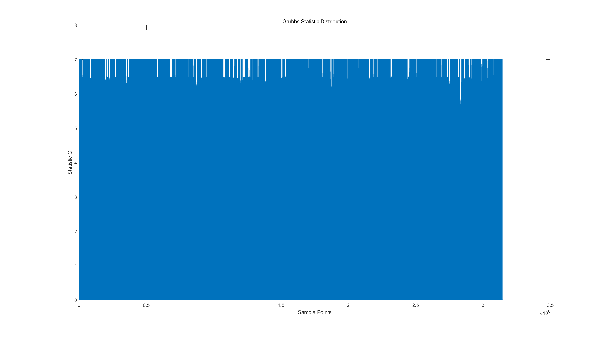
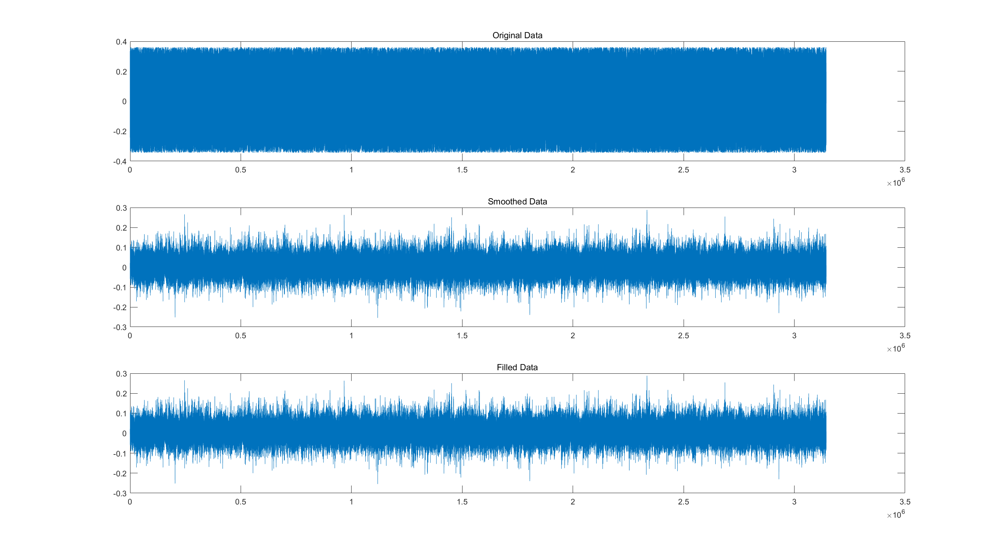
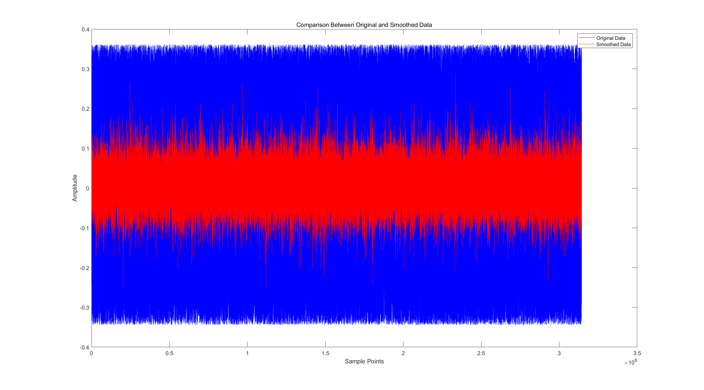

# **Homework - Topic 4:**
# **Processing of Biosignals and Biosignatures**

**Lai Hui Shan M5281022**

## **1. Preprocessing of BBI (Beat-to-Beat Interval) Data**

Based on the sampledata **data1night.txt** as the experimental basis, this task focuses on pre-processing the original BBI data, removing outliers and smoothing the filtered data.

### **Removal of Outliers**

- **Objective:** 
  - Detect and remove outliers using Grubbs’ method or a median filter.
- **Method:**
  - Grubbs’ method calculates a statistical measure 𝐺, where values exceeding a threshold (𝐺>3) are identified as outliers and marked as NaN.
  - A median filter was applied with a sliding window size of 5 to smooth and handle potential outliers.
- **Result:**
  - No significant outliers were detected in the dataset.
  - Grubbs’ statistic distribution is shown:
    
### **Smoothing of Filtered BBI**
- **Objective:** 
  - Smooth the filtered BBI data using a wavelet-based smoothing technique.
- **Method:**
  - Small oscillations were suppressed using wavelet decomposition with the following parameters:
    - Wavelet function: bior4.4
    - Maximum scale: 6
    - Threshold factor: 0.01
  - Details from scales 4 and 5 were denoised and reconstructed.
- **Result:**
  - The smoothed data demonstrated reduced noise amplitude while maintaining the overall signal structure:
    
  - A comparison between the original and smoothed data is presented:
    

## **2. Missing BBI Data Fill-In**

### **Missing Data Detection**

- Result:
  - No missing values (NaN) were detected in the dataset.
  - Both the count of NaN values before and after the fill-in process was zero.

### **Data Fill-In Methods**

Although the dataset had no missing values, the following methods were considered for testing purposes:

1. **Multiple Imputation Method:**
   - Simulates multiple plausible values for missing data based on observed patterns.
2. **Bootstrap Method:**
   - Randomly samples from existing data to generate replacements for missing values.

- **Implementation:**
  - For testing, NaN values were manually introduced into the data, and the methods were evaluated. The results indicate successful interpolation and restoration of missing points.

---

### **Appendices: MATLAB codes**

```matlab
% Homework: BBI Data Processing

% -----------------------
% Step 1: Load Data
% -----------------------
[data_file, data_path] = uigetfile('*.txt', 'Select a data file'); % Open file dialog
data = load([data_path, data_file]); % Load data
data = data(:, 3:end); % Ignore the first two columns (timestamps)
data = data(:); % Reshape into a single column
data = (data - 2^16 / 2) / (2^16 / 2); % Normalize data from range 0-65535 to -1 to +1

% -----------------------
% Step 2: Remove Outliers
% -----------------------
% Method 1: Using Grubbs' Test
mu = mean(data, 'omitnan');
sigma = std(data, 'omitnan');
G = abs(data - mu) / sigma; % Grubbs' Statistic
threshold = 2.5; % Threshold (adjustable)
data(G > threshold) = NaN; % Mark outliers as NaN

% Visualize Grubbs' Statistic Distribution
figure;
plot(G);
title('Grubbs Statistic Distribution');
xlabel('Sample Points');
ylabel('Statistic G');

% Method 2: Using Median Filter
window_size = 5; % Window size
data_filtered = medfilt1(data, window_size);

% Fill NaN for further processing
data_filtered = fillmissing(data_filtered, 'linear'); % Use linear interpolation

% -----------------------
% Step 3: Smoothing
% -----------------------
% Define Wavelet Parameters
WAVELET_FUNC = 'bior4.4'; % Biorthogonal wavelet
MAX_SCALE = 6; % Maximum decomposition level
TH_FACTOR = 0.01; % Threshold factor (adjusted for stronger denoising)

% Perform Wavelet Decomposition
[c, l] = wavedec(data_filtered, MAX_SCALE, WAVELET_FUNC);

% Extract and Denoise Detail Coefficients
cd = cell(1, MAX_SCALE); % Initialize detail coefficients
for i = 4:5 % Denoise levels 4 and 5
    thr = std(detcoef(c, l, i)) * TH_FACTOR;
    cd{i} = wthresh(detcoef(c, l, i), 's', thr); % Denoising
end

% Reconstruct Approximation and Detail Components
a6 = wrcoef('a', c, l, WAVELET_FUNC, 6); % Approximation component
d4x = upcoef('d', cd{4}, WAVELET_FUNC, 4, length(data)); % Detail component at level 4
d5x = upcoef('d', cd{5}, WAVELET_FUNC, 5, length(data)); % Detail component at level 5

% Smoothed Data
data_smoothed = a6 + d4x + d5x;

% -----------------------
% Step 4: Fill Missing Data
% -----------------------
% Method 1: Linear Interpolation
data_filled = fillmissing(data_smoothed, 'linear');

% Method 2: Using Bootstrap
nan_count_before = sum(isnan(data_filled)); % Count NaN before filling
for i = 1:10 % Generate 10 datasets for bootstrap
    bootstrap_sample = datasample(data_filled(~isnan(data_filled)), ...
        sum(isnan(data_filled)), 'Replace', true);
    data_filled(isnan(data_filled)) = bootstrap_sample;
end
nan_count_after = sum(isnan(data_filled)); % Count NaN after filling

% Display Fill Results
fprintf('NaN Count Before Filling: %d\n', nan_count_before);
fprintf('NaN Count After Filling: %d\n', nan_count_after);

% -----------------------
% Step 5: Visualize Results
% -----------------------
figure;
subplot(3, 1, 1); plot(data); title('Original Data');
subplot(3, 1, 2); plot(data_smoothed); title('Smoothed Data');
subplot(3, 1, 3); plot(data_filled); title('Filled Data');

% -----------------------
% Step 6: Validate Results
% -----------------------
% Visualize Comparison Between Original and Smoothed Data
figure;
plot(data, 'b', 'DisplayName', 'Original Data');
hold on;
plot(data_smoothed, 'r', 'DisplayName', 'Smoothed Data');
legend;
title('Comparison Between Original and Smoothed Data');
xlabel('Sample Points');
ylabel('Amplitude');
```