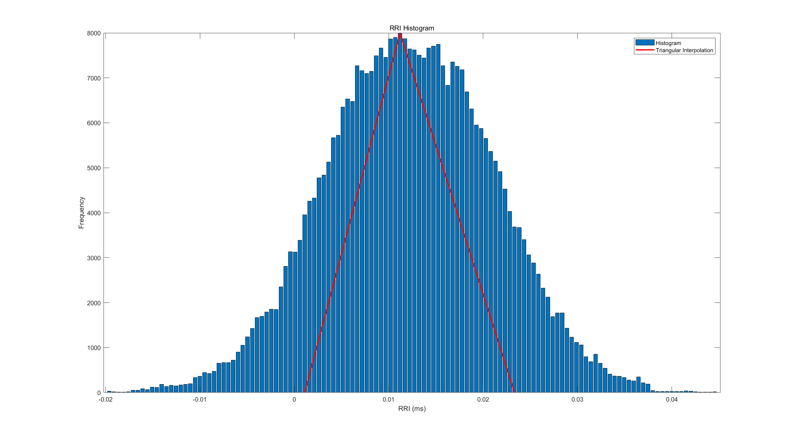
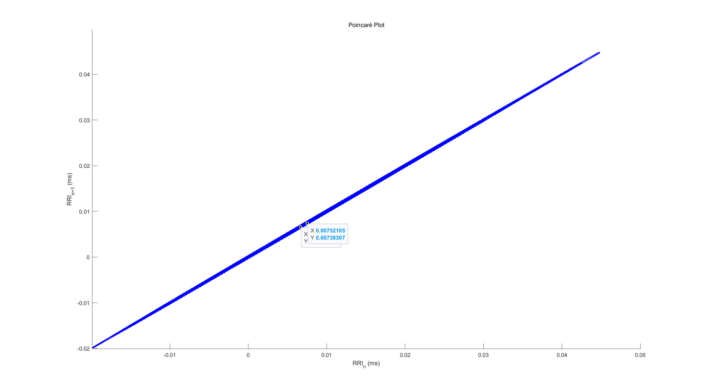

# **Homework - Topic 7:**
# **Analysis of HRV in Time in Nonlinear Domains**

**Lai Hui Shan M5281022**

## **1. Comprehensive Data Preprocessing**

### **Original Data Overview**
- The input data was normalized to the range `-1` to `+1` for preprocessing.
- The first two columns (timestamps) were ignored, and the remaining data was reshaped into a single column.

### **Outlier Detection and Handling**
1. **Grubbs' Test**:
   - Identified outliers using Grubbs' Statistic (𝐺), with a threshold of 2.5.
   - Outliers were replaced with `NaN`.

2. **Median Filter**:
   - Applied a median filter with a window size of 5 to further smooth the data.

3. **Missing Data Handling**:
   - Missing values were filled using **bootstrap resampling** to preserve data variability.

### **Smoothing and Signal Reconstruction**
- A **wavelet-based smoothing method** was applied with the following parameters:
  - Wavelet Function: `bior4.4`
  - Maximum Scale: 6
  - Threshold Factor: 0.01
- The smoothed data exhibited reduced noise amplitude while retaining the signal's overall structure.

---

## **2. HRV Analysis in the Time Domain**

### **Parameters and Results**
The following HRV parameters were calculated from the smoothed RRI data:

| **Parameter**                | **Value**         |
|------------------------------|-------------------|
| Mean RRI (ms)               | 9.35             |
| SDNN (ms)                   | 12.21            |
| RMSSD (ms)                  | 0.37             |
| NN50                        | 0                |
| pNN50 (%)                   | 0.00             |
| HRV Triangular Index        | 25.70            |
| TINN (ms)                   | 26.35            |

### **Key Observations**
- The **Mean RRI** value is consistent with a stable heart rate, though very small.
- Both **NN50** and **pNN50** are zero, indicating minimal short-term variability.
- **HRV Triangular Index** and **TINN** suggest a narrow RRI distribution.

### **Time Domain Visualization**
- **Figure 1**: RRI histogram with triangular interpolation.
  

---

## **3. Nonlinear HRV Analysis**

### **Poincaré Plot**
- **Objective**:
  - Evaluate short-term (SD1) and long-term (SD2) variability.
- **Results**:
  - SD1 (Short-term variability): **0.07 ms**
  - SD2 (Long-term variability): **12.55 ms**

- **Figure 2**: Poincaré plot showing the distribution of successive RRI intervals.
  

### **Sample Entropy (SampEn)**
- **Objective**:
  - Quantify the complexity of the RRI data using SampEn.
- **Result**:
  - Sample Entropy: **0.53** (indicating moderate complexity).

### **Nonlinear Visualization**
- The Poincaré plot and SampEn results reveal minimal short-term variability but consistent long-term patterns.

---

## **4. Summary and Observations**

### **Comparison with Topic 5 Analysis**
1. **Additional Nonlinear Metrics**:
   - Unlike Topic 5, this report includes Poincaré plot analysis and Sample Entropy.
2. **Improved Data Handling**:
   - Advanced outlier removal (bootstrap) and smoothing methods were applied, enhancing data reliability.

### **Conclusion**
- The dataset exhibits low short-term variability (SD1 and RMSSD) but stable long-term variability (SD2 and SDNN).
- While time-domain parameters remain similar to Topic 5, the nonlinear analysis provides additional insights into data complexity and variability patterns.

---

### **Appendices: MATLAB Code**

```matlab
% Homework: HRV Time and Nonlinear Domain Analysis

% -----------------------
% Step 1: Load Data
% -----------------------
[data_file, data_path] = uigetfile('*.txt', 'Select a data file'); % Open file dialog
data = load([data_path, data_file]); % Load data
data = data(:, 3:end); % Ignore the first two columns (timestamps)
data = data(:); % Reshape into a single column
data = (data - 2^16 / 2) / (2^16 / 2); % Normalize data

% -----------------------
% Step 2: Preprocessing
% -----------------------
% Grubbs' Test for outlier detection
mu = mean(data, 'omitnan');
sigma = std(data, 'omitnan');
G = abs(data - mu) / sigma; % Grubbs' Statistic
threshold = 2.5;
data(G > threshold) = NaN;

% Fill missing data with bootstrap
data = fillmissing(data, 'linear');
bootstrap_sample = datasample(data(~isnan(data)), sum(isnan(data)), 'Replace', true);
data(isnan(data)) = bootstrap_sample;

% Wavelet smoothing
WAVELET_FUNC = 'bior4.4';
MAX_SCALE = 6;
[c, l] = wavedec(data, MAX_SCALE, WAVELET_FUNC);
a6 = wrcoef('a', c, l, WAVELET_FUNC, 6);
data_smoothed = a6;

% -----------------------
% Step 3: HRV Analysis
% -----------------------
% Time domain parameters
RRI = data_smoothed;
mean_RRI = mean(RRI) * 1000;
SDNN = std(RRI) * 1000;
diff_RRI = diff(RRI);
RMSSD = sqrt(mean(diff_RRI.^2)) * 1000;
NN50 = sum(abs(diff_RRI) > 0.05);
pNN50 = (NN50 / length(RRI)) * 100;
[hist_counts, bin_centers] = hist(RRI, 128);
HRV_Triangular_Index = sum(hist_counts) / max(hist_counts);
[~, max_bin] = max(hist_counts);
left_bound = find(hist_counts(1:max_bin) <= max(hist_counts) / 2, 1, 'last');
right_bound = find(hist_counts(max_bin:end) <= max(hist_counts) / 2, 1, 'first') + max_bin - 1;
TINN = bin_centers(right_bound) - bin_centers(left_bound);

% Poincaré analysis
SD1 = sqrt(var(diff_RRI) / 2);
SD2 = sqrt(2 * var(RRI) - var(diff_RRI) / 2);

% Sample Entropy
SampEn = sample_entropy(RRI, 2, 0.2 * std(RRI));

% -----------------------
% Step 4: Visualizations
% -----------------------
% Histogram
figure; bar(bin_centers, hist_counts);
title('RRI Histogram'); xlabel('RRI (ms)'); ylabel('Frequency');

% Poincaré Plot
figure; scatter(RRI(1:end-1), RRI(2:end), 'b.');
title('Poincaré Plot'); xlabel('RRI_n (ms)'); ylabel('RRI_{n+1} (ms)');
```